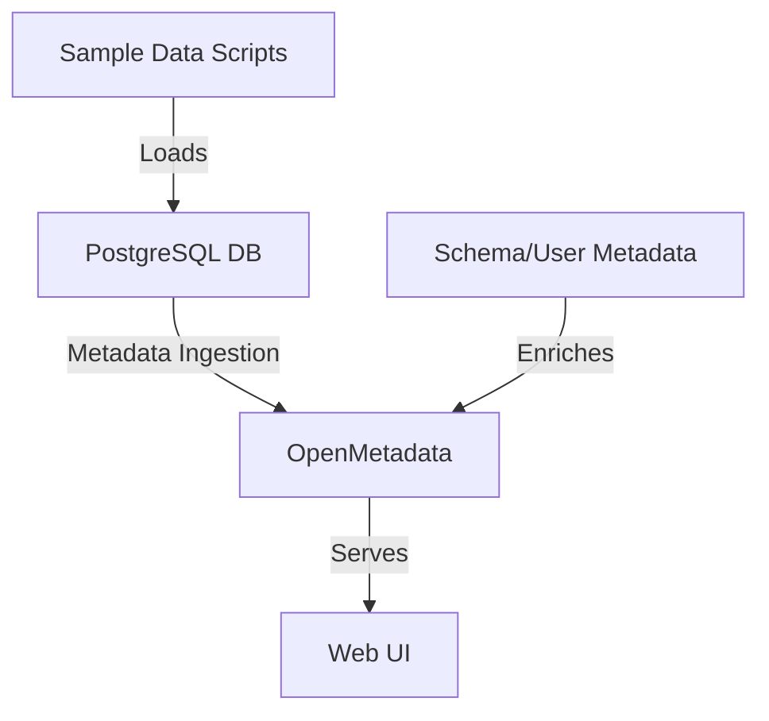

# Real Estate Data Catalog Case Study

## Overview
This project implements a data catalog system for a real estate data warehouse using OpenMetadata. The system allows users to explore both technical and business information about available schemas, tables, and columns.

The sample data represents a fictitious real estate company that provides property listings and valuation services for buyers. The data model encompasses various aspects of the business including property listings, market analysis, customer interactions, and operational data.

## Why OpenMetadata?
OpenMetadata was chosen for this implementation because it provides:
- Rich metadata management capabilities
- Built-in data discovery and exploration features
- Support for both technical and business metadata
- REST API for automation and integration
- Active open-source community

## Architecture



## Data Model
The system contains the following key schemas:

1. **real_estate_listings**: Core property listing data, photos, and location information
2. **sales**: Customer and transaction management
3. **marketing**: SEO, social media campaigns, and engagement tracking
4. **user_behaviour**: Website analytics and email engagement
5. **customer_support**: Support tickets and customer interactions
6. **real_estate_trackers**: Property search preferences and notifications
7. **czech_market_data**: Regional market statistics and trends
8. **location_amenities**: Nearby facilities and transport information
9. **human_resources**: Internal team management
10. **cloud_infrastructure**: System operations and costs

## Getting Started

### Prerequisites
- Docker and Docker Compose
- Python 3.8+

### Installation & Setup

1. Create and start the OpenMetadata and PostgreSQL containers:

```bash
./1_create_openmetadata_and_database.sh
```

2. Configure the database connection in OpenMetadata:

```bash
./2_setup_database_connection.sh
```

3. Ingest the sample data:

```bash
./3_ingest_metadata.sh
```

4. Access the OpenMetadata UI at: http://localhost:8585
   - Username: admin@open-metadata.org
   - Password: admin

## Project Structure
- `src/database_setup/`: Database schema definitions and sample data loading scripts
- `src/openmetadata/`: OpenMetadata configuration and metadata ingestion scripts
- `src/openmetadata/sample_metadata/`: Business descriptions and user definitions

## Future Enhancements
- Implement Domains, Tiers, and Glossary
- Add data profiling
- Create data quality tests


